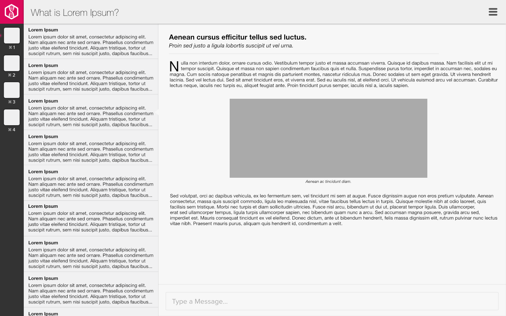

#### [Visit the live demo here](http://jetbalagtas.github.io/css_challenge/)

# css_challenge - Wireframe => HTML

## Description
Convert a wireframe into an HTML page.

For this test, I turned the wireframe below into a page that renders well from a normal desktop size.



### Installation

To see it in action or to work on it, you can clone this repository. In your terminal, enter:

```git clone git@github.com:jetbalagtas/css_challenge.git```

### Developing

* via terminal, navigate to the location where you cloned this repo.
* via terminal, install dependencies by running: ```npm install```
* compile the .scss file once by entering this in terminal:
```node-sass css/style.scss css/style.css```
* if developing and have it auto-compile on save, the command is ```node-sass css/style.scss css/style.css -w```
* in another terminal tab, enter: ```http-server``` or to specify a port, run: ```http-server -p <your-port>``` (ie. 3000)
* terminal will indicate which port it is using to listen, so the development url is: ```localhost:<listening-port>```
* in your browser, open ```localhost:<listening-port>```
* if you specified port 3000, for example, you should go to ```localhost:3000``` in your browser

### License

MIT
